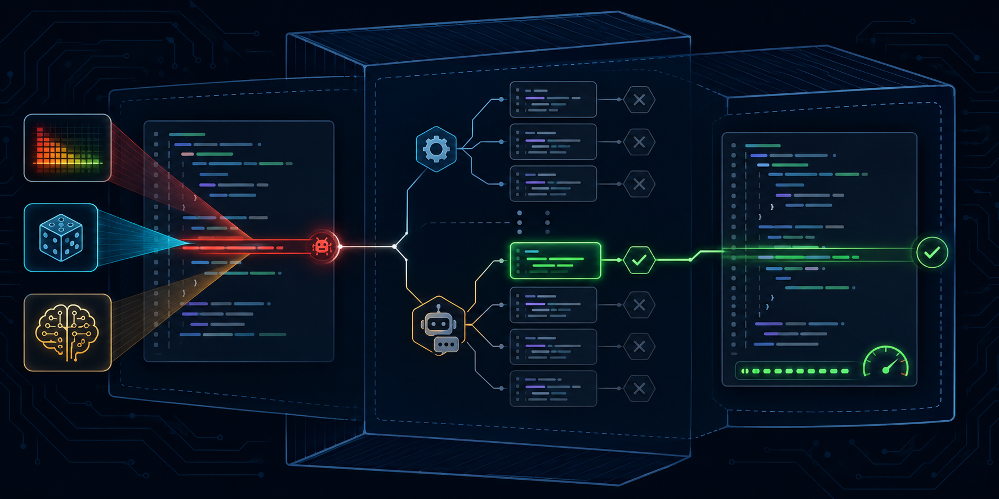
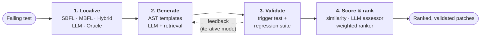

<p align="center">
  
</p>

<h1 align="center">Repair Framework</h1>

<p align="center">
  <strong>From a failing test to a validated, scored patch, automatically.</strong><br>
  Automated debugging and program repair for Python: fault localization, LLM and
  template-based patch generation, and patch validation that goes beyond "the tests pass".
</p>

<p align="center">
  
  
  
  
</p>

<p align="center">
  <a href="#quickstart">Quickstart</a> ·
  <a href="#how-it-works">How it works</a> ·
  <a href="#results">Results</a> ·
  <a href="#features">Features</a> ·
  <a href="docs/README.md">Documentation</a>
</p>

---

## Why Repair Framework?

Debugging is one of the most expensive parts of shipping software. Automated program
repair promises to take on part of it, but most tools stop at *"the tests pass"*. That
rewards patches that overfit the test suite. Most are also hard-wired to one
localizer, one model and one benchmark.

Repair Framework is built differently:

- **End-to-end.** One command goes from a failing test to suspicious lines, candidate
  patches, and a validated, ranked list of fixes.
- **Strict validation.** A patch counts only if it fixes the failing test *and* breaks
  nothing that passed before. Surviving patches are then graded against the
  developer's fix and reviewed by an LLM, so plausible-but-wrong patches can be caught.
- **Pluggable.** Every stage is an interface. Swap localizers, repair engines,
  rankers, benchmarks, or the model: any OpenAI-compatible endpoint works.
- **Reproducible.** Code runs in isolated Docker containers with per-project Python
  versions, and every run leaves a full audit trail of config, logs, diffs and
  patched files.

## How it works



| Stage | What you can plug in |
|---|---|
| **1. Localize** | SBFL (Ochiai, Tarantula, D*, plus the **Jaccard** and custom **WSBI** metrics) · MBFL (Metallaxis, MUSE, with budgeted random mutant selection) · weighted **Hybrid** · **LLM** localization · the perfect-FL **oracle** as an upper-bound baseline |
| **2. Generate** | **Template** engine: 6 AST mutation operators · **LLM** engine: single-shot, context-enriched, few-shot, iterative test-failure feedback, tool-assisted code retrieval |
| **3. Validate** | trigger test + regression-suite subset check, in a sandboxed executor container with budgets, timeouts and guaranteed file restoration |
| **4. Score & rank** | exact-diff match (a data-contamination signal) · graded **context similarity** to the developer fix · **LLM quality assessment** with rationale · **weighted composite ranker** |

## Results

The full LLM pipeline (LLM localization → LLM repair with code retrieval → LLM
assessment) was run against the template engine and two simpler LLM strategies on
the same BugsInPy bugs:

| Bug | Best earlier approach | Full LLM pipeline |
|---|---|---|
| black#1 | 0 plausible patches | **6 plausible** (assessor quality up to 0.93) |
| black#3 | 0 plausible patches | **4 plausible** (but assessor quality only 0.12: likely overfit) |
| tornado#14 | 3 exact developer fixes, *given the oracle location* | **9 exact developer fixes**, localizing on its own |
| scrapy#2 | 2 plausible, *given the oracle location* | **9 plausible**, similarity 0.92 to the developer fix |

More findings from the published experiments:

- **Context matters most.** Adding the failing test and its traceback to the prompt
  **quadrupled** plausible patches (4 → 16 across four bugs).
- **Hybrid localization can beat either family alone.** On fastapi#6 the faulty line
  moved from rank 82 (SBFL) and rank 6 (MBFL) to **rank 3** (hybrid). The gain isn't
  uniform: on the other two bugs tested, SBFL ranked better.
- **Retrieval makes the model more efficient.** With code-search tools, the model
  found 4 plausible patches from 10 candidates, versus 3 from 15 without them.
- **Graded metrics catch what pass/fail can't.** Similarity flags near-misses that an
  exact-diff check scores as zero, and the assessor flags test-passing patches that
  probably don't fix the bug.

> Bug sets are small and LLM runs are single samples at temperature 1.0, so treat
> these as early signals, not benchmarks. All tables, caveats and raw artifacts:
> **[docs/results.md](docs/results.md)** · [`experiment_results/`](experiment_results/)

## Quickstart

You need **Docker** and **Git**. LLM features also need an OpenAI-compatible API key.

```bash
git clone https://github.com/Sonzakir/Repair-Framework.git
cd Repair-Framework
docker compose build
docker compose run --rm apr-framework
```

Inside the container:

```bash
python -m apr_framework bugsinpy setup                  # one-time: benchmark + sandboxed executor
python -m apr_framework bugsinpy test black 1           # check out, build and reproduce a real bug
python -m apr_framework localize --project black --bug 1 --top-n 10
python -m apr_framework repair   --project black --bug 1   # template repair: no API key needed
```

Run the full LLM pipeline in one command:

```bash
python -m apr_framework configure --llm-api-key-env OPENAI_API_KEY   # stores the key in .env

python -m apr_framework repair --project black --bug 1 \
  --technique llm --fl-backend llm --retrieval-budget 3 --assess --similarity-score \
  --model gpt-5.4 --temperature 1.0 \
  --llm-base-url https://api.openai.com/v1 --llm-api-key-env OPENAI_API_KEY
```

Example output (scrapy#2, LLM repair with oracle FL and `--similarity-score`):

```text
Run directory: /workspace/runs/run_xxx
Project:       scrapy
Bug ID:        2
Status:        plausible
Generated:     6 candidate(s)
Validated:     6 candidate(s)
Plausible:     6 patch(es)
Correct:       0 patch(es)
1st plausible: 9.1s
Total time:    10.9s
###################################################################################
# Similarity scores for plausible patches (closeness to the developer fix, 0.0-1.0):
#  1.00        identical to the developer fix
#  0.85-0.99   very similar (nearly the same edit)
#  0.60-0.84   similar (recognizable overlap)
#  0.30-0.59   loosely similar
#  0.00-0.29   different (little in common)
###################################################################################
  Patch 1 (llm-1-0) -> 0.84  (similar (recognizable overlap))
  ...
  Patch 6 (llm-2-2) -> 0.92  (very similar (nearly the same edit))
```

Every run writes `runs/run_NNN/` with `config.json`, `repair_results.json`,
`execution.log` and a `.diff` + patched file for each plausible patch.

→ Full setup, provider configuration and troubleshooting: **[Getting started](docs/getting-started.md)**

## Features

**Fault localization** · [docs](docs/fault-localization.md)
- FauxPy-backed SBFL and MBFL at statement or function granularity; every metric table is kept for later stages
- New SBFL metrics patched into FauxPy: **Jaccard** and **WSBI** (Weighted SBI, `ef / (ef + α·ep)`)
- **Budgeted MBFL:** cap mutant validation with random selection to make MBFL practical on large projects
- **Hybrid:** min-max-normalized, weighted merge of SBFL + MBFL, with tie-breaks toward locations both found
- **LLM localization:** traceback- and mock-anchored source windows, strict-JSON ranking, robust parsing
- **Perfect-FL oracle** from the developer fix, to separate repair quality from localization quality

**Patch generation** · [template](docs/template-repair.md) · [LLM](docs/llm-repair.md)
- **Template engine:** `arith`, `comp`, `obo`, `bool`, `negate` and `return` AST operators; fast, offline, always syntactically valid
- **LLM engine:** whole-function rewrites with line-anchored prompts, so the framework builds the diff itself and it is always well-formed
- **Context enrichment:** failing-test source + unpatched traceback in the prompt
- **Few-shot:** real buggy → fixed pairs from sibling bugs, built offline
- **Iterative repair** (ChatRepair-style): failed validations are fed back as the next turn, with separate messages for trigger and regression failures
- **Context retrieval:** the model can call `get_function_definition`, `get_class_definition` and `find_usages` before patching

**Validation and scoring** · [docs](docs/validation-and-scoring.md)
- **Plausibility** = trigger test passes **and** the regression suite's failing set is a subset of the baseline
- **Exact diff**, a reformatting-neutral match with the developer fix, kept as a data-contamination signal
- **Context similarity:** a hunk-level `0.0–1.0` closeness score that rewards near-misses
- **LLM assessor:** `quality_score` + rationale per plausible patch, and an assessment-ranked list
- **Weighted ranker:** suspiciousness + simplicity + operator priority, with configurable weights

**Evaluation at scale** · [docs](docs/evaluation.md)
- One-command experiment matrices: localization (8 techniques), template repair, LLM repair variants, and a four-approach comparison
- Generated Markdown reports and per-cell run artifacts; LLM matrices flush `results.json` after every cell, so long API runs survive interruptions
- Error cells instead of aborted matrices when one bug's toolchain fails

**Operations**
- Two-container design: a slim framework container drives a long-lived BugsInPy executor
- [Multi-Python BugsInPy fork](docs/architecture.md#design-decisions) that installs each project's Python on demand (submitted upstream as [soarsmu/BugsInPy#110](https://github.com/soarsmu/BugsInPy/pull/110))
- Works with OpenAI or any OpenAI-compatible endpoint, with built-in rate limiting and a prompt-dump debug switch (`APR_LLM_DEBUG_PROMPT`)

## Architecture

Every stage sits behind an abstract interface and exchanges shared domain objects
(`LocalizationResult`, `PatchCandidate`, `RepairAttemptResult`, …), never raw strings.
Adding a benchmark, localizer, repair engine, ranker or LLM provider means adding one
class.

| Interface | Implementations |
|---|---|
| `BenchmarkAdapter` | BugsInPy |
| `FaultLocalizer` | FauxPy (SBFL/MBFL), Hybrid, LLM, Perfect |
| `RepairAlgorithm` | Template, LLM, Dummy |
| `PatchRanker` | Weighted composite |
| `LLMClient` | OpenAI-compatible |
| `EvaluationRunner` / `ReportGenerator` | repair runner + four comparison matrices / archive reports |

→ **[Architecture](docs/architecture.md)**: source layout, design decisions, extension points

## Documentation

| Guide | What's inside |
|---|---|
| [Getting started](docs/getting-started.md) | install, LLM provider setup, first run, troubleshooting |
| [Fault localization](docs/fault-localization.md) | SBFL, MBFL, Hybrid, LLM-FL, oracle |
| [Template repair](docs/template-repair.md) | operators, cost controls, outputs |
| [LLM repair](docs/llm-repair.md) | prompts, enrichment, few-shot, iterative, retrieval, assessment, full pipeline |
| [Validation, scoring & ranking](docs/validation-and-scoring.md) | plausibility, exact diff vs. similarity, metrics, ranker |
| [Evaluation harnesses](docs/evaluation.md) | experiment matrices and artifacts |
| [Results](docs/results.md) | every published number, with caveats |
| [CLI reference](docs/cli-reference.md) | all commands and flags |

## Known limitations and next steps

- **One benchmark so far.** BugsInPy is the only adapter. The `BenchmarkAdapter`
  interface is in place for more.
- **pytest-based projects only** for FauxPy localization; `unittest discover` projects
  aren't supported yet.
- **FauxPy can't reach every bug.** Python 3.7.0 pins and dependency conflicts (e.g.
  fastapi's pydantic pin) block it on some projects. LLM localization covers those.
- **Regression feedback is coarse.** The iterative loop says *that* a previously
  passing test broke, not *which* one.
- **WSBI's zero-passing-test edge case.** With no passing tests, WSBI can't tell
  covered lines apart.

## Development

```bash
python -m venv .venv && source .venv/bin/activate
pip install -e ".[dev]"
ruff format . && ruff check .
pytest tests/
```

CI runs the test suite on Python 3.10 and 3.12 and builds the sdist/wheel. Changes
that touch the pipeline should also be verified end-to-end inside Docker against a
real checked-out bug (see [Getting started](docs/getting-started.md)).

## Acknowledgements

- [BugsInPy](https://github.com/soarsmu/BugsInPy): the benchmark of real Python bugs
- [FauxPy](https://pypi.org/project/fauxpy/): the fault-localization engine behind SBFL/MBFL
- Banner illustration generated with OpenAI DALL·E

## License

[MIT](LICENSE) © 2026 Fazli Soner Kiraz
