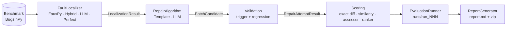

# Architecture

Repair Framework is built from small, replaceable parts. Each stage of the
pipeline (benchmark access, fault localization, repair, evaluation, reporting) sits
behind an abstract base class, so you change behaviour by passing in a different
concrete class. The rest of the pipeline does not change.

> Benchmark-specific details stay behind framework APIs. Repair, localization,
> evaluation and reporting are components you can replace or extend.

## Pipeline at a glance



## Core interfaces

| Concern | Interface | Implementations |
|---|---|---|
| Benchmark | `BenchmarkAdapter` (`benchmarks/base.py`) | `BugsInPyAdapter` |
| Fault localization | `FaultLocalizer` (`localization/base.py`) | `FauxPyLocalizer`, `HybridFaultLocalizer`, `LLMFaultLocalizer`, `PerfectFaultLocalizer` |
| Repair | `RepairAlgorithm` (`repair/base.py`) | `TemplateRepairAlgorithm`, `LLMRepairAlgorithm`, `DummyRepairAlgorithm` |
| Patch ranking | `PatchRanker` (`repair/ranking/base.py`) | `WeightedCompositeRanker` |
| LLM transport | `LLMClient` (`repair/llm/client.py`) | `OpenAICompatibleClient` |
| Evaluation | `EvaluationRunner` (`evaluation/base.py`) | `RepairEvaluationRunner`, `DummyEvaluationRunner`, comparison runners |
| Reporting | `ReportGenerator` (`reporting/base.py`) | `ArchiveReportGenerator` |

## Source layout

```text
src/apr_framework/
  core/
    models.py        # shared dataclasses: BugIdentifier, CheckoutResult, TestRunResult,
                     # LocalizationResult, RankedLocation, PatchCandidate, RepairAttemptResult,
                     # EvaluationResult, LocalizationConfig, RepairRunMetrics
    exceptions.py    # APRFrameworkError, BenchmarkError, ConfigurationError
  benchmarks/
    base.py          # BenchmarkAdapter interface (checkout / prepare_environment / run_tests / list_*)
    bugsinpy.py      # BugsInPyAdapter + BugsInPyToolchain (all Docker/shell calls go here)
    registry.py      # benchmark factory/registry
  cli/
    parser.py        # argparse grammar
    app.py           # command dispatch
  localization/
    base.py          # FaultLocalizer interface
    fauxpy.py        # FauxPy localizer, config, toolchain, and output parser
    hybrid.py        # weighted SBFL + MBFL result combiner
    perfect.py       # oracle locations from the developer fix (bug_patch.txt)
    llm.py           # LLM-based fault localizer
    prompts/         # fl_prompt1.txt
    scripts/         # in-place FauxPy patches (extra SBFL metrics, MBFL mutant selection)
  repair/
    base.py          # RepairAlgorithm interface (+ repair_loop / llm_query_count hooks)
    dummy.py         # random ground-truth / no-op repair component
    correctness.py   # exact-diff match + context similarity score
    regression.py    # regression half of plausibility
    run_loop.py      # shared generate-and-validate budget loop
    patch_applier.py # apply/test/restore helper with try/finally restoration
    ranking/         # PatchRanker, WeightedCompositeRanker, create_ranker()
    template/        # AST mutation operators, patch generator, validator
    llm/             # prompt builder, context enricher, few-shot, feedback,
                     # retrieval tools/protocol/loop, patch extractor, client
    assessment/      # LLM patch assessor + response parser + prompts
  evaluation/
    base.py                          # EvaluationRunner interface
    run_writer.py                    # runs/run_NNN/ writer
    dummy_runner.py                  # full APR pipeline for the dummy repair component
    repair_runner.py                 # RepairEvaluationRunner
    ground_truth.py                  # parse bug_patch.txt, rank ground truth in a ranking
    localization_runner.py           # evaluate-localization matrix
    repair_comparison_runner.py      # evaluate-repair matrix
    llm_repair_comparison_runner.py  # evaluate-llm-repair matrix
    course_approaches.py             # the four compared approaches, as data
    course_comparison_runner.py      # evaluate-course-comparison matrix
  reporting/
    base.py          # ReportGenerator interface
    archive.py       # report.md summary + zipped run artifacts
```

## Design decisions

**Shared domain models.** Components exchange `BugIdentifier`, `CheckoutResult`,
`TestRunResult`, `PatchCandidate`, `RepairAttemptResult` and `EvaluationResult`
objects from `apr_framework.core.models`, not benchmark-specific strings passed
through the whole system. That gives the framework stable domain definitions to
build on. The models are still evolving and may change as new implementations are
added.

**Benchmark commands are hidden.** Framework code calls
`BenchmarkAdapter.checkout`, `prepare_environment` and `run_tests`. BugsInPy commands
such as `bugsinpy-checkout`, `bugsinpy-safe-compile` and `bugsinpy-test` stay inside
`BugsInPyAdapter` and `BugsInPyToolchain`.

**BugsInPy runs in a sibling Docker container.** BugsInPy needs old Python versions
and a separate environment per project. Those are not installed into the framework
environment. Instead, the framework controls a long-lived executor container named
`apr-bugsinpy-executor`. The framework container stays small: it needs only Python,
Git and the Docker CLI. If `APR_HOST_PROJECT_ROOT` is not set, the executor
container's volume mounts fail.

**Multi-Python BugsInPy fork.** Upstream BugsInPy is tied to a single Python version.
The framework uses its own fork ([Sonzakir/BugsInPy](https://github.com/Sonzakir/BugsInPy.git)),
which supports several Python versions inside one Docker environment. The same
changes were submitted upstream as
[soarsmu/BugsInPy#110](https://github.com/soarsmu/BugsInPy/pull/110). The fork:

- replaces the fixed `python:3.12-slim-trixie` base image;
- adds `pyenv` to the image, so several Python versions can be installed and selected in one container;
- installs Python versions lazily, only when a checked-out project is compiled;
- adds a `bugsinpy-safe-compile` wrapper. The wrapper reads the required Python version from the checkout's `bugsinpy_bug.info`, pins it with a checkout-local `.python-version`, then runs the existing `bugsinpy-compile` without Python version clashes.

**Local paths separate tools from experiments.**

```text
.tools/bugsinpy        # local BugsInPy clone and metadata
.workspace/bugsinpy/   # checked-out buggy projects and evaluation worktrees
runs/run_NNN/          # structured single-run outputs
experiment_results/    # evaluation-matrix outputs (results.json + README.md)
```

**Repair is replaceable.** Every repair backend implements the same `RepairAlgorithm`
interface, from the dummy component to the template and LLM engines.

**FauxPy is isolated behind the localization interface.** `FauxPyLocalizer`
implements `FaultLocalizer`. `FauxPyToolchain` handles command execution, FauxPy
installation checks, pytest invocation and output parsing. The rest of the
framework consumes structured `LocalizationResult` and `RankedLocation` objects and
never parses FauxPy output directly.

**FauxPy metrics are reusable.** The configured metric drives the primary ranking
the CLI shows. Every metric table parsed from FauxPy output is also stored in
`metadata["all_metrics"]`, so Tarantula, Ochiai, D*, Jaccard, WSBI and any other
emitted table stay available to later repair or reporting components.

**One validation loop.** The generate-and-validate budget loop lives in
`repair/run_loop.py`, not inside any algorithm. It uses only the `RepairAlgorithm`
methods (`generate_patches` / `validate_patch`), so `RepairEvaluationRunner` and
every backend share a single implementation.

## Extension points

| Hook | Where | Default | Overridden by |
|---|---|---|---|
| `RepairAlgorithm.repair_loop(bug, checkout, *, budget, stop_on_first)` | `repair/base.py` | delegates to `run_validation_loop` | `LLMRepairAlgorithm` when `--iterative` is set |
| `RepairAlgorithm.llm_query_count()` | `repair/base.py` | `None` | `LLMRepairAlgorithm` (reports its client's call count) |
| `LLMClient` | `repair/llm/client.py` | — | add a subclass to support a new provider; `LLMRepairAlgorithm` is unchanged |
| `PatchRanker` / `create_ranker()` | `repair/ranking/` | `none` | `WeightedCompositeRanker` (`--ranker weighted`) |
| `BenchmarkAdapter` / registry | `benchmarks/` | BugsInPy | add an adapter + register it |

`OpenAICompatibleClient` depends only on the narrow `LLMConnectionConfig` protocol
(`model_name`, `temperature`, `base_url`, `api_key_env_var`). Because of that, the
repair config and the LLM localization config both satisfy it without depending on
each other.

## Capability map

| Capability | Implementation / command |
| --- | --- |
| Benchmark interface | `BenchmarkAdapter` |
| Fault localization interface | `FaultLocalizer` |
| Repair interface | `RepairAlgorithm` |
| Evaluation interface | `EvaluationRunner` |
| Report interface | `ReportGenerator` |
| BugsInPy list projects/bugs | `bugsinpy list-projects`, `bugsinpy list-bugs` |
| BugsInPy checkout | `bugsinpy checkout` |
| BugsInPy prepare environment | safe compilation via `bugsinpy-safe-compile` and internal evaluation setup |
| BugsInPy run tests | `bugsinpy test` |
| Structured test results | `TestRunResult` with counts and raw output |
| FauxPy localization CLI | `localize --backend fauxpy --project <project> --bug <id>` |
| FauxPy metric selection | `localize --metric ochiai`, `localize --metric jaccard` |
| Hybrid localization | `localize --family hybrid --sbfl-metric ochiai --mbfl-metric metallaxis` |
| FauxPy granularity selection | `localize --granularity statement` / `--granularity function` |
| FauxPy output parser | `parse_fauxpy_output` parses all metrics or one selected metric |
| FauxPy result metadata | `LocalizationResult.metadata["all_metrics"]` stores every parsed metric table |
| CLI entry point | `python -m apr_framework` and the `apr-framework` script |
| Dummy repair component | `DummyRepairAlgorithm` |
| Evaluation output handling | `runs/run_xxx/config.json`, `results.json`, `execution.log`, `*.zip` |
| Patch ranking | `WeightedCompositeRanker` via `--ranker weighted` (`--ranker-weights` to override) |
| Rank of first correct patch | `rank_of_first_correct` in the `repair_results.json` metrics block |
| Repair evaluation matrix | `bugsinpy evaluate-repair --bugs "tornado:14,scrapy:2,black:1" --fl-modes "auto,perfect"` |
| Repair evaluation output | `experiment_results/repair/results.json` + `README.md` + per-cell `run_artifacts/` |
| LLM repair context retrieval | `repair --technique llm --retrieval-budget 3` |
| LLM fault localization for repair | `repair --fl-backend llm` |
| Full LLM pipeline (one command) | `repair --technique llm --fl-backend llm --retrieval-budget 3 --assess --similarity-score` |
| Four-approach comparison | `bugsinpy evaluate-course-comparison --bugs "black:1,black:3"` |
| Comparison output | `experiment_results/course_comparison/results.json` + `README.md` + per-cell `run_artifacts/` |
